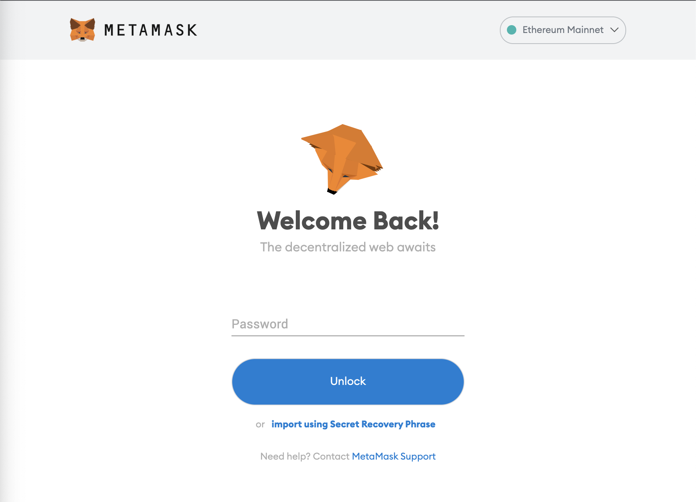
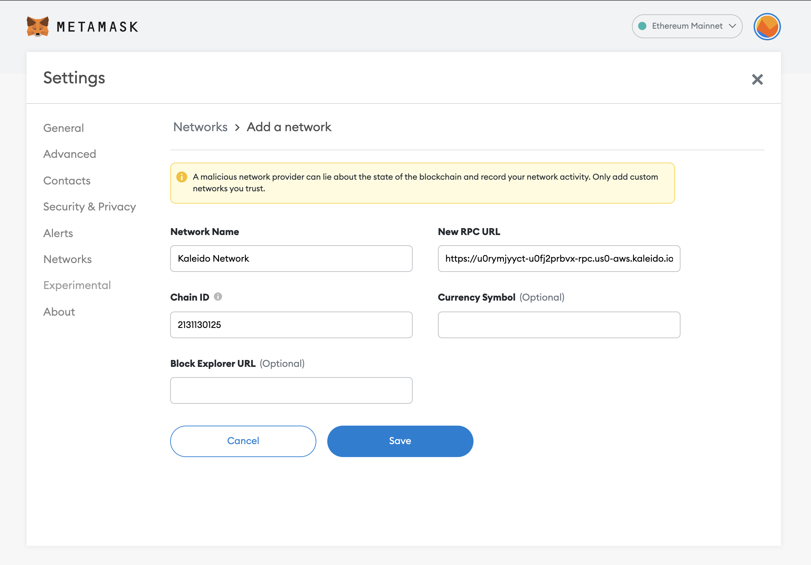
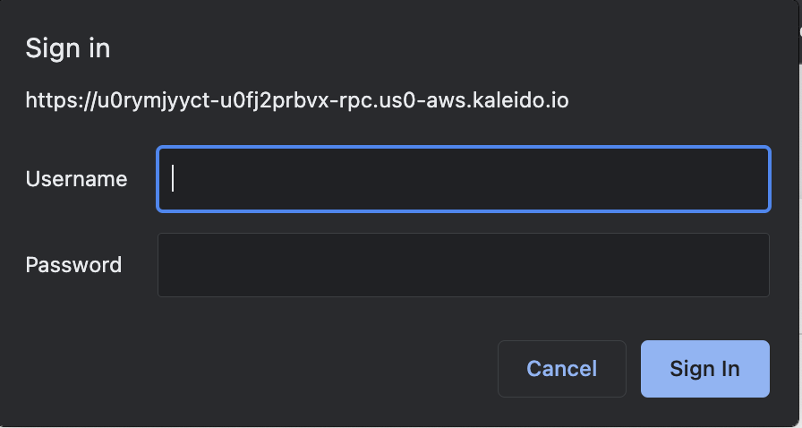

# The Idea

This repo is an NFT Marketplace with the ability to mint, transfer, and redeem NFTs from a fake popular shoe brand - Hoff Industries.

### The idea behind this project is as follows:

Hoff Industries is an up and coming hot startup that has been producing the most marketable shoes in the country. Each time Hoff Industries releases a new shoe, their inventory is immediately sold out and these shoes become worth more than the original price on secondary markets.

With such an exponential demand and possibility of high resell value. Hoff Industries has encountered some issue with scammers claiming to own a pair of exlusive Hoff Industry sneakers and reselling counterfits. The community has been outspoken about this problem and Hoff Industry is starting to see a dip in sales due to these scammers.

### Solution:

Hoff Industries is releasing an NFT platform that will allow consumers to buy the right to own a shoe via ERC-721 tokens. By purchasing an NFT, that NFT will provide proof of ownership of an exlusive Hoff Industry shoe.

When a consumer purchases an NFT, that individual has two options. First, they can redeem the NFT, which will allow them to actually recieve the manufactured shoe. Conversly, they would have the option to sell the NFT to another consumer for possibly a higher price than what that individual paid for.

Hoff Industries NFT marketplace provides a secure and trustworthy place to not only mint new NFTs but also encourages the secondary market of peer to peer buying and selling the ownership of an NFT.

# Project Stack.

### Frontend

    1. React
    2. Material UI

### Backend

    1. Kaliedo Platform
    2. AWS Amplify
    3. GraphQL
    4. AWS DynamoDB
    5. AWS S3

### MetaMask Instructions

In order to properly use this application. One will have to configure MetaMask to use the Kaliedo Network.

1. Go to MetaMask and sign into your current account.

2. Create a Network

With these Creds:

- RPC URL: https://u0rymjyyct-u0fj2prbvx-rpc.us0-aws.kaleido.io
- Chain ID: 2131130125

3. Will Prompt for a UserName and Password

Add these creds:

Usename: u0b0v1fncu
Password: ~see repo owner~

4. Import from one of these 4 Accounts

Select an account to import:

    Wallet:
    ID: pk8jrx4l
    Address: 0xc7D0CF8ed168C341fA538618A6467638DE73237F
    Private Key: a4ea93a30f44a0bf2133975b050115ca0f18843f5640724ac8ccfa14c112e11d
    Recover Passphrase: dumb tail breeze half spare rack girl vendor umbrella kid chase fit

    Wallet:
    ID: 8ogqhokb
    Address: 0xcfd25f87B74e610ED3c09C4017e146E23fE7ADD9
    Private Key: f099e965699dbe82cb7e69dacb48085b3d331596d2bc05a59dd257b8aa45eb5a
    Recover PassPhrase: hungry image harvest uphold uphold noise blue camera seminar option debris coil

    Wallet:
    ID: 60x5q74v
    Address: 0x3007A5dF53b5541F41c36fdA0F24345e30Dc2aF7
    Private Key: 31a08f7800784518797cab0e454985be277da3b5cfcd8628200febb3e094bf29
    Recover PassPhrase: asthma scan donkey wonder desert tiger toilet annual boat filter rib diamond

    Wallet:
    ID: gwgbctuu
    Address: 0x1B0a0C195528174772764160157fE52d84488d7E
    Private Key: a250d25b3fcaffb0fc2cf4823becf33372c9508d5321313c393c71c6fa99c6c3
    Recover PassPhrase: alarm pizza common shaft lake brother benefit lucky wall afraid under tortoise

5. You're all done!
